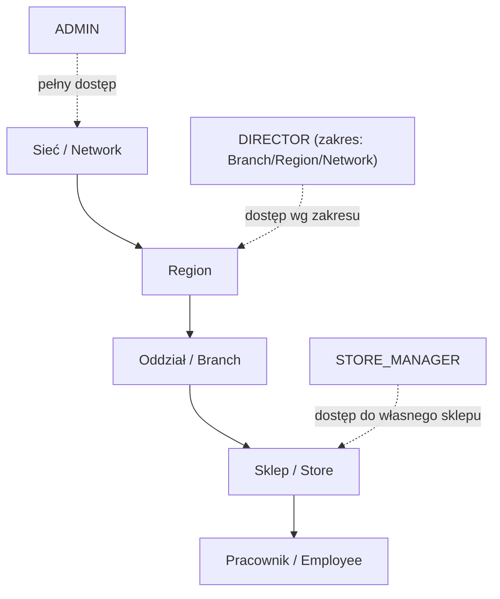
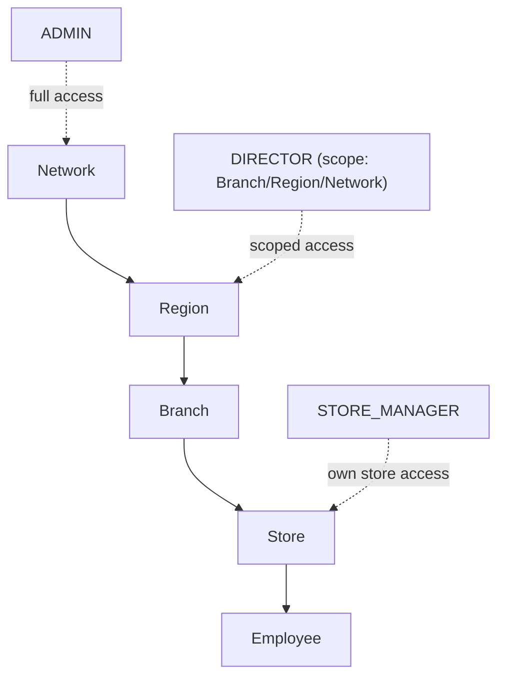

<div align="center">

# 📅 StworzGrafik

**Automatyczne układanie grafików pracy dla sieci sklepów / oddziałów**
**Automatic employee shift-scheduling engine for retail chains**

<!-- TODO: podmień poniższy link na właściwy adres wdrożenia -->
<!-- TODO: replace the link below with your actual deployment URL -->
[](https://stworzgrafik.online)

<!-- TODO: po podpięciu CI podmień na prawdziwy badge z GitHub Actions -->
<!-- TODO: once CI is configured, swap this for a real GitHub Actions badge -->


🇵🇱 [Polski](#-opis-pl) • 🇬🇧 [English](#-description-en)

</div>

---

## 🇵🇱 Opis (PL)

### O projekcie

**StworzGrafik** to backend systemu do automatycznego generowania miesięcznych grafików pracy dla wielooddziałowych sieci (sklepy / punkty usługowe). API napisane w Javie (Spring Boot) obsługuje pełny proces: od zdefiniowania zapotrzebowania godzinowego danego sklepu, przez dostępność i preferencje pracowników, po automatyczne ułożenie grafiku zgodnego z wymogami prawa pracy oraz jego eksport.

Repozytorium zawiera **backend (REST API)**. Aplikacja frontendowa (SPA komunikująca się z API przez REST + JWT) jest utrzymywana osobno.

> ⚠️ To repozytorium prezentuje architekturę i sposób pracy nad projektem. Rdzeń algorytmu układania grafiku jest opisany na poziomie ogólnym — bez wchodzenia w szczegóły implementacyjne (patrz sekcja [Licencja](#-licencja--dostępność-kodu)).

### Kluczowe funkcje

- 🧠 **Automatyczny generator grafiku** — silnik dopasowuje pracowników do zmian na podstawie godzinowego zapotrzebowania sklepu, ról (otwarcie / zamknięcie / kasa / kredyt), dni dostaw towaru oraz pracowników „specjalnych”.
- 🙋 **Dostępność i preferencje pracowników** — urlopy, propozycje dni wolnych, propozycje zmian oraz delegacje między sklepami są uwzględniane przy układaniu grafiku.
- ✅ **Analiza zgodności grafiku** — automatyczne wykrywanie m.in.: niedoboru obsady, nierównomiernego rozkładu zmian, naruszeń wymaganego odpoczynku (np. tygodniowy odpoczynek), nadmiaru wniosków o dni wolne oraz sugestii zamiany zmian/godzin między pracownikami.
- 🏢 **Struktura organizacyjna** — hierarchia *Sieć → Region → Oddział (Branch) → Sklep (Store) → Pracownik*, z rolami użytkowników i zakresem uprawnień dyrektora (oddział / region / cała sieć).
- ⏱️ **Normy godzinowe i okresy rozliczeniowe** — konfigurowalne miesięczne normy pracy oraz okresy rozliczeniowe.
- 🎉 **Kalendarz świąt** — konfiguracja dni świątecznych wpływających na godziny otwarcia i grafik.
- 📤 **Eksport danych** — generowanie plików Excel i PDF, przechowywanych w Cloudflare R2 z tymczasowymi (presigned) linkami do pobrania.
- 🔐 **Bezpieczeństwo** — logowanie JWT, role `ADMIN` / `DIRECTOR` / `STORE_MANAGER`, autoryzacja na poziomie metod (w tym dostęp scope’owany do konkretnego sklepu/regionu).
- 🚀 **Tryb demo** — endpoint tworzący tymczasowe konto demonstracyjne bez rejestracji, do szybkiego przetestowania aplikacji.

### Stos technologiczny

| Warstwa | Technologia |
|---|---|
| Język / runtime | Java 17+ |
| Framework | Spring Boot 3 (Spring Web, Spring Security, Spring Data JPA) |
| Baza danych | relacyjna baza danych (JPA / Hibernate) — skonfiguruj wg własnych preferencji (np. PostgreSQL) |
| Mapowanie DTO | MapStruct |
| Uwierzytelnianie | JWT (stateless) + role + zakres uprawnień |
| Eksport plików | Apache POI (Excel), OpenPDF (PDF) |
| Storage plików | Cloudflare R2 (kompatybilny z AWS S3 SDK), presigned URL |
| Build | Maven (dołączony Maven Wrapper `mvnw`) |
| Konteneryzacja | Docker (`compose.yaml`) |
| Jakość kodu | JetBrains Qodana (`qodana.yaml`) |

### Architektura / hierarchia organizacyjna



### Model ról i uprawnień

| Rola | Opis |
|---|---|
| `ADMIN` | Pełny dostęp do systemu, konfiguracja globalna (okresy rozliczeniowe, święta, użytkownicy). |
| `DIRECTOR` | Dostęp ograniczony zakresem (`DirectorScope`): `BRANCH`, `REGION` lub `NETWORK`. |
| `STORE_MANAGER` | Zarządza grafikiem i pracownikami przypisanego sklepu. |

Autoryzacja realizowana jest na poziomie metod kontrolerów (`@PreAuthorize`), w tym poprzez dedykowany serwis sprawdzający dostęp do konkretnego sklepu/oddziału.

### Uruchomienie lokalne

**Wymagania:**
- JDK 17+
- Maven (lub użyj dołączonego `./mvnw`)
- Relacyjna baza danych
- Konto Cloudflare R2 (opcjonalne — wymagane tylko do eksportu plików do chmury)

```bash
# 1. Sklonuj repozytorium
git clone https://github.com/makcc93/stworz-grafik-online.git
cd stworz-grafik-online

# 2. Skonfiguruj zmienne środowiskowe (patrz tabela poniżej)

# 3. Uruchom aplikację
./mvnw spring-boot:run

# lub przez Docker Compose
docker compose up
```

API domyślnie dostępne będzie pod `http://localhost:8080/api`.

### Zmienne środowiskowe

| Zmienna | Opis | Wymagane |
|---|---|---|
| `SPRING_DATASOURCE_URL` / `SPRING_DATASOURCE_USERNAME` / `SPRING_DATASOURCE_PASSWORD` | Połączenie z bazą danych | ✅ |
| `APPLICATION_SECURITY_JWT_SECRET_KEY` | Klucz podpisujący tokeny JWT (Base64) | ✅ |
| `APPLICATION_SECURITY_JWT_EXPIRATION` | Czas ważności tokenu JWT (ms) | ✅ |
| `APP_ADMIN_LOGIN` / `APP_ADMIN_PASSWORD` | Dane konta administratora tworzonego przy pierwszym starcie | ✅ |
| `APP_CORS_ALLOWED_ORIGINS` | Dozwolone originy CORS (domyślnie `http://localhost:5173`) | opcjonalne |
| `CLOUDFLARE_R2_ENDPOINT` / `CLOUDFLARE_R2_ACCESS_KEY` / `CLOUDFLARE_R2_SECRET_KEY` / `CLOUDFLARE_R2_BUCKET` | Konfiguracja storage’u plików (eksport Excel/PDF) | opcjonalne* |
| `CLOUDFLARE_R2_PRESIGNED_URL_EXPIRY_MINUTES` | Czas ważności linku do pobrania pliku (domyślnie 15 min) | opcjonalne |

\* wymagane, jeśli korzystasz z funkcji eksportu i pobierania plików.

### Przegląd API (skrót)

Pełny kontrakt API (schematy żądań/odpowiedzi) nie jest publikowany w tym repozytorium — poniżej znajduje się przegląd głównych grup endpointów.

| Grupa | Bazowy path | Opis |
|---|---|---|
| Autoryzacja | `/api/auth` | Logowanie, wydawanie tokenu JWT |
| Demo | `/api/demo` | Tworzenie tymczasowego konta demonstracyjnego |
| Użytkownicy | `/api/users` | Zarządzanie kontami i rolami |
| Sieć / Region / Oddział / Sklep | `/api/regions`, `/api/branches`, `/api/stores` | Struktura organizacyjna |
| Pracownicy | `/api/employees`, `/.../position`, `/.../vacation`, `/.../delegation`, `/.../proposal` | Kartoteka pracowników, stanowiska, urlopy, delegacje, propozycje |
| Zapotrzebowanie | `/api/demand-drafts` | Definiowanie zapotrzebowania godzinowego |
| Grafik | `/api/schedules`, `/.../details`, `/.../hours`, `/.../messages` | Generowanie i zarządzanie grafikiem |
| Zmiany | `/api/shifts`, `/.../shift-type-config` | Konfiguracja typów zmian |
| Rozliczenia | `/api/billing-period` | Okresy rozliczeniowe |
| Kalendarz | `/api/holidays` | Dni świąteczne |
| Eksport | (wewnątrz modułu `fileExport`) | Generowanie i pobieranie plików Excel/PDF |

### Demo

🔗 **Live demo:** [stworzgrafik.online](https://stworzgrafik.online)

Aplikacja udostępnia też endpoint `GET /api/demo`, który natychmiast tworzy tymczasowe konto testowe — bez potrzeby rejestracji.

### Licencja / dostępność kodu

Kod w tym repozytorium jest **publicznie widoczny w celach demonstracyjnych / portfolio**, ale **nie jest udostępniony na otwartej licencji** (typu MIT/Apache) — repozytorium nie zawiera pliku `LICENSE`, co zgodnie z domyślnym prawem autorskim oznacza **„All Rights Reserved”**: kod można przeglądać, ale nie wolno go kopiować, modyfikować, wdrażać ani wykorzystywać komercyjnie bez pisemnej zgody autora.

Jeśli chcesz to sformalizować jeszcze mocniej, masz kilka opcji do rozważenia:
- dodać krótką notatkę `LICENSE` z treścią „All rights reserved” (najprostsze, zgodne ze stanem obecnym),
- użyć licencji typu *source-available* (np. „PolyForm Noncommercial”, „Business Source License”), jeśli chcesz pozwolić np. na naukę z kodu, ale zabronić użycia komercyjnego,
- pozostawić stan obecny (brak pliku `LICENSE`) — jest on ważny prawnie, ale bywa mylący dla odwiedzających repo, dlatego warto przynajmniej dopisać notatkę tak jak w tym README.

*Nie jestem prawnikiem — przy wyborze konkretnej licencji warto skonsultować się z prawnikiem, szczególnie jeśli projekt ma być komercjalizowany.*

### Autor

Projekt rozwijany i utrzymywany przez [@makcc93](https://github.com/makcc93).

---
---

## 🇬🇧 Description (EN)

### About

**StworzGrafik** (Polish for *"create a schedule"*) is the backend of a system for automatically generating monthly employee shift schedules for multi-branch retail chains. The Java (Spring Boot) API handles the full workflow: defining a store's hourly staffing demand, accounting for employee availability and preferences, and automatically producing a schedule compliant with labor-law rest requirements, plus exporting it.

This repository contains the **backend (REST API)**. The frontend SPA (communicating with the API over REST + JWT) is maintained separately.

> ⚠️ This repository is meant to showcase the project's architecture and engineering approach. The core scheduling algorithm is described at a high level only, without implementation details (see [License](#-license--code-availability)).

### Key Features

- 🧠 **Automatic schedule generator** — matches employees to shifts based on a store's hourly demand, roles (opening/closing/checkout/cash handling), delivery days, and "special" employees.
- 🙋 **Employee availability & preferences** — vacations, requested days off, shift preference proposals, and inter-store delegations are all factored into schedule generation.
- ✅ **Schedule compliance analysis** — automatically flags issues such as understaffing, uneven shift distribution, rest-time violations (e.g. weekly rest requirements), excessive day-off requests, and suggests shift/hour swaps between employees.
- 🏢 **Organizational structure** — *Network → Region → Branch → Store → Employee* hierarchy, with user roles and a director's permission scope (branch / region / entire network).
- ⏱️ **Work norms & billing periods** — configurable monthly work-hour norms and billing periods.
- 🎉 **Holiday calendar** — configurable public holidays affecting opening hours and scheduling.
- 📤 **Data export** — generates Excel and PDF files, stored in Cloudflare R2 with time-limited (presigned) download links.
- 🔐 **Security** — JWT authentication, `ADMIN` / `DIRECTOR` / `STORE_MANAGER` roles, method-level authorization (including access scoped to a specific store/branch).
- 🚀 **Demo mode** — an endpoint that instantly creates a temporary demo account, no registration required.

### Tech Stack

| Layer | Technology |
|---|---|
| Language / runtime | Java 17+ |
| Framework | Spring Boot 3 (Spring Web, Spring Security, Spring Data JPA) |
| Database | relational database (JPA / Hibernate) — MySQL |
| DTO mapping | MapStruct |
| Auth | Stateless JWT + roles + permission scope |
| File export | Apache POI (Excel), OpenPDF (PDF) |
| File storage | Cloudflare R2 (S3-compatible, AWS SDK), presigned URLs |
| Build | Maven (Maven Wrapper `mvnw` included) |
| Containerization | Docker (`compose.yaml`) |
| Code quality | JetBrains Qodana (`qodana.yaml`) |

### Architecture / Organizational Hierarchy



### Roles & Permissions

| Role | Description |
|---|---|
| `ADMIN` | Full system access; global configuration (billing periods, holidays, users). |
| `DIRECTOR` | Access limited by scope (`DirectorScope`): `BRANCH`, `REGION`, or `NETWORK`. |
| `STORE_MANAGER` | Manages the schedule and employees of their assigned store. |

Authorization is enforced at the controller-method level (`@PreAuthorize`), including a dedicated service that checks access to a specific store/branch.

### Getting Started

**Requirements:**
- JDK 17+
- Maven (or use the included `./mvnw`)
- A relational database
- A Cloudflare R2 account (optional — only needed for cloud file export)

```bash
# 1. Clone the repository
git clone https://github.com/makcc93/stworz-grafik-online.git
cd stworz-grafik-online

# 2. Configure environment variables (see table below)

# 3. Run the application
./mvnw spring-boot:run

# or via Docker Compose
docker compose up
```

The API will be available by default at `http://localhost:8080/api`.

### Environment Variables

| Variable | Description | Required |
|---|---|---|
| `SPRING_DATASOURCE_URL` / `SPRING_DATASOURCE_USERNAME` / `SPRING_DATASOURCE_PASSWORD` | Database connection | ✅ |
| `APPLICATION_SECURITY_JWT_SECRET_KEY` | JWT signing key (Base64) | ✅ |
| `APPLICATION_SECURITY_JWT_EXPIRATION` | JWT token expiration (ms) | ✅ |
| `APP_ADMIN_LOGIN` / `APP_ADMIN_PASSWORD` | Admin account credentials created on first startup | ✅ |
| `APP_CORS_ALLOWED_ORIGINS` | Allowed CORS origins (defaults to `http://localhost:5173`) | optional |
| `CLOUDFLARE_R2_ENDPOINT` / `CLOUDFLARE_R2_ACCESS_KEY` / `CLOUDFLARE_R2_SECRET_KEY` / `CLOUDFLARE_R2_BUCKET` | File storage configuration (Excel/PDF export) | optional* |
| `CLOUDFLARE_R2_PRESIGNED_URL_EXPIRY_MINUTES` | Download link expiry time (defaults to 15 min) | optional |

\* required only if you use the file export/download features.

### API Overview

The full API contract (request/response schemas) isn't published in this repository — below is an overview of the main endpoint groups.

| Group | Base path | Description |
|---|---|---|
| Auth | `/api/auth` | Login, JWT issuance |
| Demo | `/api/demo` | Temporary demo account creation |
| Users | `/api/users` | Account & role management |
| Network / Region / Branch / Store | `/api/regions`, `/api/branches`, `/api/stores` | Organizational structure |
| Employees | `/api/employees`, `/.../position`, `/.../vacation`, `/.../delegation`, `/.../proposal` | Employee records, positions, vacations, delegations, proposals |
| Demand | `/api/demand-drafts` | Hourly staffing demand definition |
| Schedule | `/api/schedules`, `/.../details`, `/.../hours`, `/.../messages` | Schedule generation & management |
| Shifts | `/api/shifts`, `/.../shift-type-config` | Shift type configuration |
| Billing | `/api/billing-period` | Billing periods |
| Calendar | `/api/holidays` | Public holidays |
| Export | (inside the `fileExport` module) | Excel/PDF file generation & download |

### Demo

🔗 **Live demo:** [stworzgrafik.online](https://stworzgrafik.online)

The app also exposes a `GET /api/demo` endpoint that instantly provisions a temporary test account — no registration needed.

### License / Code Availability

The code in this repository is **publicly visible for demonstration/portfolio purposes**, but **it is not released under an open-source license** (e.g. MIT/Apache) — there is no `LICENSE` file, which under default copyright law means **"All Rights Reserved"**: the code may be viewed, but not copied, modified, deployed, or used commercially without the author's written permission.

If you'd like to formalize this further, a few options:
- add a short `LICENSE` file stating "All rights reserved" (simplest, matches the current state),
- use a *source-available* license (e.g. "PolyForm Noncommercial", "Business Source License") if you want to allow learning from the code while blocking commercial use,
- keep the current state (no `LICENSE` file) — it's legally valid, but can be confusing to visitors, so it's worth at least noting it explicitly, as done here.

*I'm not a lawyer — it's worth consulting one when choosing a specific license, especially if the project will be commercialized.*

### Author

Built and maintained by [@makcc93](https://github.com/makcc93).
